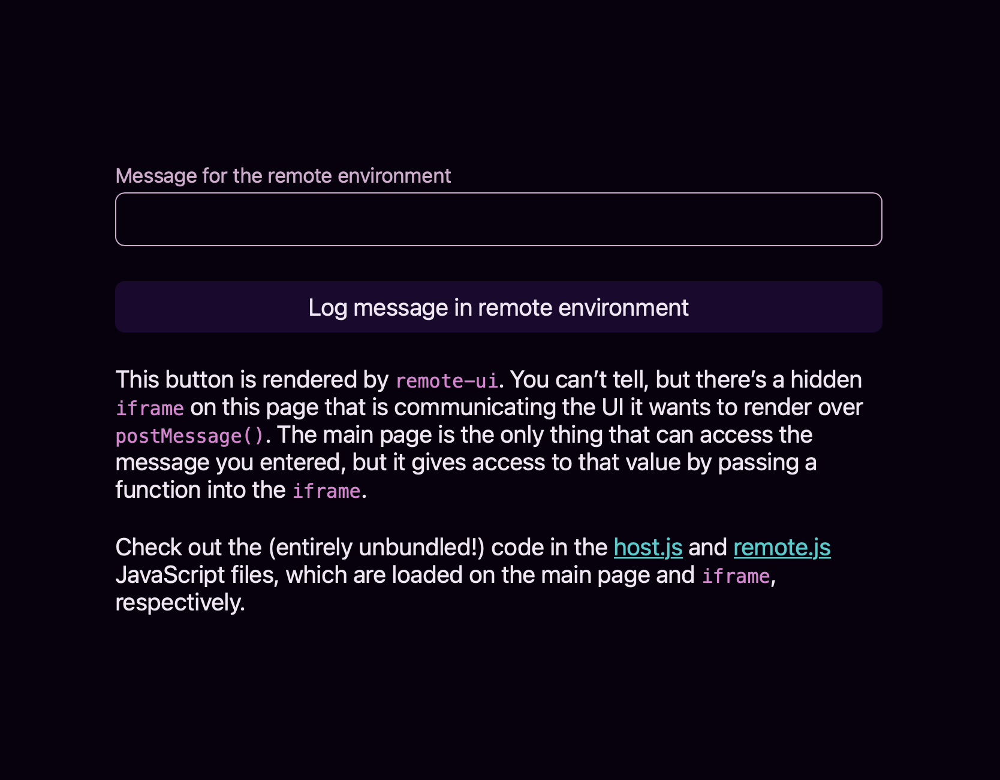

# Example: remote-ui using the DOM

This example shows how you can use remote-ui to implement off-main-thread rendering using just the DOM. All the code for this example is available in the `./app` directory, and is served without the help of a build tool.

To see the example running in your browser, run `yarn run example:vanilla-dom` from the root of directory of the repo. A small local HTTP server will spin up to serve the contents of `./app`.

## Navigating this example

The [index.html file](./app/index.html) is the “host” HTML file. It is loaded by the browser, and takes care of rendering the actual UI. It loads the [styles](./app/style.css) and [scripts](./app/host.js) for the main page, including the definition for a few [web components](./app/components.js) that are written using [Lit](https://lit.dev).

The [remote.html file](./app/remote.html) is the “remote” HTML file — it is loaded by the main HTML file, and will host the “remote” code that communicates its desired UI through remote-ui. We load this file in an `iframe` to give us a sandboxed JavaScript environment, but we could have used any other JavaScript environment instead. A [web worker](https://developer.mozilla.org/en-US/docs/Web/API/Web_Workers_API/Using_web_workers) is a great candidate to use instead, since we don’t need the DOM provided by an `iframe`. We didn’t use a web worker in this example because not all browsers currently support [module workers](https://web.dev/module-workers/), and we wanted to write all the code using native ES modules.

In this example, the main page renders a `ui-text-field` custom element, allows the remote context to render a `Button` component (which maps to a `ui-button` custom element), and provides an API to the remote context to get access to the current value of the text field (which the remote context does not otherwise have access to).

Each file has additional comments explaining smaller bits and pieces of the implementation.
